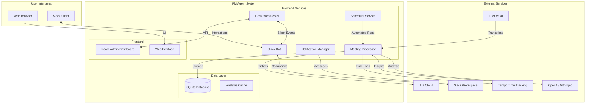
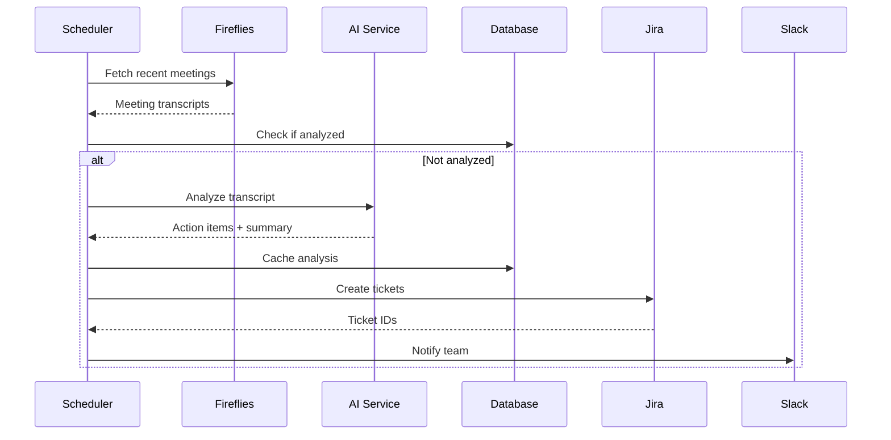
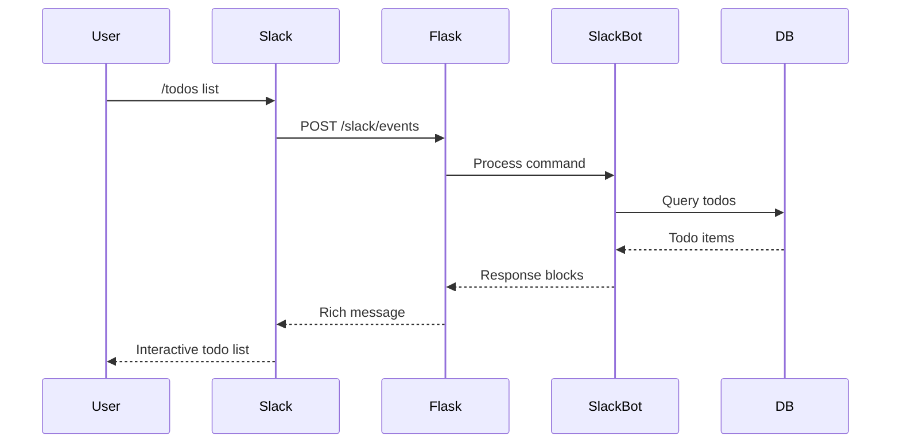
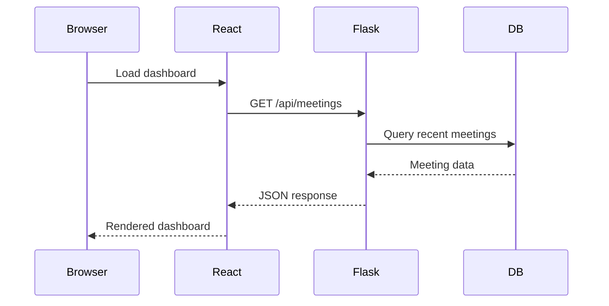

# PM Agent - Comprehensive Architecture Documentation

## Table of Contents
- [Overview](#overview)
- [System Architecture](#system-architecture)
- [Backend Architecture](#backend-architecture)
- [Frontend Architecture](#frontend-architecture)
- [External Integrations](#external-integrations)
- [Data Flow](#data-flow)
- [Deployment & Infrastructure](#deployment--infrastructure)
- [Development Workflow](#development-workflow)
- [Configuration](#configuration)
- [API Reference](#api-reference)

## Overview

The PM Agent is an autonomous project management system that intelligently processes meeting transcripts from Fireflies.ai, extracts actionable items using AI, and creates structured tickets in Jira. It provides both automated workflows and interactive management interfaces through web and Slack integrations.

### Core Value Proposition
- **Automated Meeting Analysis**: AI-powered extraction of action items, decisions, and risks from meeting transcripts
- **Intelligent Task Management**: Automatic creation and management of Jira tickets with proper categorization
- **Multi-Channel Notifications**: Slack, email, and web notifications for seamless team coordination
- **Time Tracking Integration**: Tempo time logging integration for comprehensive project monitoring
- **Interactive Management**: Web dashboard and Slack bot for real-time task management

### Technology Stack
- **Backend**: Python 3.9+, Flask, SQLAlchemy, LangChain
- **Frontend**: React 19.1.1, TypeScript, Material-UI, React Admin
- **AI/ML**: OpenAI GPT-4, Anthropic Claude (configurable)
- **Database**: SQLite (development), PostgreSQL (production ready)
- **Integrations**: Jira REST API, Fireflies GraphQL, Slack Bot API, Tempo API
- **Infrastructure**: Docker, ngrok (development), nginx (production)

## System Architecture



## Backend Architecture

### Core Components

#### 1. Web Interface (`src/web_interface.py`)
**Primary Flask Application Server**
- **Purpose**: Main HTTP server handling web requests and Slack webhook events
- **Port**: 3030 (configurable via `WEB_PORT`)
- **Key Features**:
  - Slack event subscription handling with signature verification
  - CORS support for React frontend communication
  - Health check endpoints for monitoring
  - Integration with all service managers

```python
# Key endpoints:
GET  /                     # Health check
POST /slack/events         # Slack webhook handler
GET  /api/*               # Various API endpoints for frontend
```

#### 2. Services Layer

##### Meeting Analysis (`src/processors/transcript_analyzer.py`)
- **Purpose**: AI-powered analysis of meeting transcripts
- **AI Integration**: LangChain + OpenAI GPT-4 or Anthropic Claude
- **Output**: Structured ActionItem objects with titles, descriptions, assignees, priorities
- **Caching**: Results cached in database to avoid redundant API calls

##### Project Monitor (`src/services/project_monitor.py`)
- **Purpose**: Tracks project status and generates reports
- **Features**: Progress tracking, deadline monitoring, resource allocation analysis

##### Scheduler (`src/services/scheduler.py`)
- **Purpose**: Manages automated task execution
- **Schedule**: Configurable cron expressions (default: 8 AM and 5 PM daily)
- **Tasks**: Meeting analysis, report generation, notification sending

##### Hours Report Agent (`src/services/hours_report_agent.py`)
- **Purpose**: Integrates with Tempo for time tracking analysis
- **Features**: Automatic time log creation, hourly reports, project time allocation

#### 3. Integration Layer

##### Fireflies Integration (`src/integrations/fireflies.py`)
- **API**: GraphQL endpoint at `https://api.fireflies.ai/graphql`
- **Authentication**: API key-based authentication
- **Key Operations**:
  - Fetch recent meeting transcripts
  - Retrieve specific meeting details
  - Handle timestamp conversion (milliseconds to datetime)

```python
# Critical timestamp handling:
datetime.fromtimestamp(date_val / 1000)  # Fireflies returns milliseconds
```

##### Jira Integration (`src/integrations/jira_mcp.py`)
- **API**: Jira REST API v3 with MCP (Model Context Protocol) fallback
- **Authentication**: Basic Auth with API tokens
- **Key Operations**:
  - Create tickets with proper field mapping
  - Retrieve project metadata (users, priorities, issue types)
  - Bulk operations for efficient processing

```python
# User API endpoints (common issue resolution):
/rest/api/3/user/search                    # Primary user search
/rest/api/3/user/assignable/multiProjectSearch  # Project-specific users
```

##### Slack Integration (`src/managers/slack_bot.py`)
- **Framework**: Slack Bolt for Python
- **Authentication**: Bot token + signing secret verification
- **Features**:
  - Slash commands (`/todos`, `/todo`)
  - Interactive buttons and modals
  - Channel message monitoring for TODO detection
  - Real-time notifications with rich formatting

```python
# Key commands:
/todos list                # List all TODOs
/todos add [description]   # Create new TODO
/todo [description]        # Alias for /todos add
```

#### 4. Data Management

##### Database Models (`src/models.py`)
- **ORM**: SQLAlchemy with relationship mapping
- **Tables**:
  - `meetings`: Meeting metadata and analysis cache
  - `action_items`: Extracted tasks with Jira ticket references
  - `todo_items`: User-managed TODO list with status tracking
  - `projects`: Project information and linking

##### TODO Manager (`src/managers/todo_manager.py`)
- **Purpose**: CRUD operations for TODO items
- **Features**: Status transitions, user assignment, priority management
- **Integration**: Syncs with both web interface and Slack bot

##### Notification Manager (`src/managers/notifications.py`)
- **Purpose**: Multi-channel notification dispatch
- **Channels**: Slack (primary), Email (SMTP), Teams (webhook)
- **Features**: Rich message formatting, error handling, delivery confirmation

#### 5. MCP Server (`src/mcp/fireflies_mcp_server.py`)
- **Purpose**: Model Context Protocol server for Fireflies integration
- **Usage**: Provides structured access to meeting data for AI processing
- **Protocol**: Standardized interface for AI model interactions

### Directory Structure

```
src/
├── integrations/           # External API integrations
│   ├── fireflies.py       # Fireflies.ai GraphQL client
│   └── jira_mcp.py        # Jira REST API + MCP client
├── managers/              # Business logic managers
│   ├── notifications.py   # Multi-channel notifications
│   ├── slack_bot.py       # Slack Bot implementation
│   └── todo_manager.py    # TODO CRUD operations
├── processors/            # Data processing engines
│   ├── transcript_analyzer.py  # AI-powered meeting analysis
│   └── interactive_processor.py # User interaction handling
├── services/              # Background services
│   ├── project_monitor.py      # Project tracking
│   ├── project_notifications.py # Project-specific alerts
│   ├── meeting_project_linker.py # Meeting-project association
│   ├── scheduler.py            # Task scheduling
│   └── hours_report_agent.py   # Time tracking integration
├── mcp/                   # Model Context Protocol servers
│   └── fireflies_mcp_server.py # Fireflies MCP server
├── models.py              # SQLAlchemy database models
└── web_interface.py       # Main Flask application
```

### Configuration Management

#### Settings System (`config/settings.py`)
Centralized configuration with environment variable loading:

```python
@dataclass
class Settings:
    fireflies: FirefliesConfig      # API key, base URL
    jira: JiraConfig               # URL, credentials, default project
    notifications: NotificationConfig # Slack, email, Teams settings
    ai: AIConfig                   # Provider, model, parameters
    agent: AgentConfig             # Schedule, debug, logging
    web: WebConfig                 # Server host, port, base URL
```

#### Environment Variables
```bash
# Core integrations
FIREFLIES_API_KEY=api_key_here
JIRA_URL=https://company.atlassian.net
JIRA_USERNAME=user@company.com
JIRA_API_TOKEN=api_token_here

# AI configuration
AI_PROVIDER=openai  # or anthropic
OPENAI_API_KEY=sk-...
OPENAI_MODEL=gpt-4
AI_TEMPERATURE=0.3
AI_MAX_TOKENS=5000

# Slack integration
SLACK_BOT_TOKEN=xoxb-...
SLACK_SIGNING_SECRET=signing_secret
SLACK_CHANNEL=#pm-updates

# Tempo time tracking
TEMPO_API_TOKEN=tempo_token_here

# Web server
WEB_BASE_URL=http://localhost:3030
WEB_PORT=3030
```

## Frontend Architecture

### Technology Stack
- **Framework**: React 19.1.1 with TypeScript
- **UI Library**: Material-UI (MUI) v5.18.0
- **Admin Interface**: React Admin v5.11.3
- **State Management**: React Admin's built-in state management
- **HTTP Client**: React Admin's data provider (JSON Server compatible)
- **Build Tool**: Create React App with TypeScript template

### Component Architecture

#### Layout Components
```
frontend/src/components/
├── Layout.tsx              # Main application layout with navigation
└── Dashboard.tsx           # Primary dashboard component
```

#### React Admin Integration
```typescript
// Main App structure
<Admin dataProvider={dataProvider} layout={Layout}>
  <Resource name="meetings" />
  <Resource name="action_items" />
  <Resource name="todos" />
  <Resource name="projects" />
</Admin>
```

### Key Features
- **Responsive Design**: Material-UI responsive breakpoints
- **Data Management**: Automatic CRUD operations via React Admin
- **Real-time Updates**: WebSocket integration for live data updates
- **Rich UI Components**: Material Design components for consistent UX
- **Type Safety**: Full TypeScript integration for compile-time safety

### API Integration
The frontend communicates with the Flask backend through standardized REST endpoints:

```typescript
// Data provider configuration
const dataProvider = jsonServerProvider('/api', httpClient);

// Supported operations:
GET    /api/meetings         # List meetings
POST   /api/meetings         # Create meeting
GET    /api/meetings/123     # Get meeting details
PUT    /api/meetings/123     # Update meeting
DELETE /api/meetings/123     # Delete meeting
```

### Development Server
```bash
cd frontend
npm start                    # Starts on http://localhost:3000
PORT=3001 npm start         # Custom port
```

## External Integrations

### 1. Fireflies.ai Integration
**Purpose**: Meeting transcript source
**API**: GraphQL at `https://api.fireflies.ai/graphql`
**Authentication**: API Key in headers

```graphql
query GetTranscripts {
  transcripts(limit: 50) {
    title
    date
    transcript {
      sentences {
        text
        speaker_name
        start_time
      }
    }
  }
}
```

**Key Implementation Details**:
- Timestamp conversion: Fireflies returns milliseconds, convert with `datetime.fromtimestamp(date_val / 1000)`
- Rate limiting: Implement exponential backoff for API calls
- Error handling: Graceful degradation when API is unavailable

### 2. Jira Cloud Integration
**Purpose**: Task creation and project management
**API**: Jira REST API v3 at `{JIRA_URL}/rest/api/3/`
**Authentication**: Basic Auth with email + API token

```python
# Critical API endpoints:
POST /rest/api/3/issue                    # Create issue
GET  /rest/api/3/project                  # List projects
GET  /rest/api/3/user/search              # Find users
GET  /rest/api/3/priority                 # Get priorities
GET  /rest/api/3/issuetype/project/{id}   # Project issue types
```

**Common Issues & Solutions**:
- User API 404: Use `/user/search` instead of `/user/assignable/search`
- Permission errors: Ensure API token has necessary project permissions
- Field validation: Always validate required fields before submission

### 3. Slack Integration
**Purpose**: Team notifications and interactive management
**API**: Slack Web API + Events API
**Authentication**: Bot token + webhook signature verification

**Bot Capabilities**:
- **Slash Commands**: `/todos list`, `/todos add`, `/todo`
- **Interactive Elements**: Buttons, modals, dropdown menus
- **Event Subscriptions**: Channel messages, mentions, reactions
- **Rich Messaging**: Blocks, attachments, threaded conversations

**Setup Requirements**:
1. Create Slack app in workspace
2. Configure OAuth scopes: `channels:read`, `chat:write`, `commands`, `users:read`
3. Set up Event Subscriptions with ngrok URL (development)
4. Install app to workspace and add to desired channels

### 4. Tempo Time Tracking Integration
**Purpose**: Time logging and project hour tracking
**API**: Tempo REST API v4
**Authentication**: API token in headers

```python
# Key endpoints:
GET  /rest/tempo-timesheets/4/worklogs    # Get time entries
POST /rest/tempo-timesheets/4/worklogs    # Create time entry
PUT  /rest/tempo-timesheets/4/worklogs/{id} # Update entry
```

**MCP Tools Available**:
- `retrieveWorklogs(startDate, endDate)`: Get time entries for date range
- `createWorklog(issueKey, timeSpentHours, date, description)`: Log time
- `bulkCreateWorklogs(worklogEntries[])`: Create multiple entries
- `editWorklog(worklogId, timeSpentHours, date)`: Update existing entry
- `deleteWorklog(worklogId)`: Remove time entry

## Data Flow

### 1. Meeting Processing Workflow


### 2. Slack Interaction Flow


### 3. Web Interface Data Flow


## Deployment & Infrastructure

### Development Environment
```bash
# Backend setup
python3 -m venv venv
source venv/bin/activate
pip install -r requirements.txt
cp .env.example .env  # Configure environment variables

# Frontend setup
cd frontend
npm install

# Start services
python3 src/web_interface.py  # Backend on :3030
cd frontend && npm start       # Frontend on :3000

# Expose for Slack (development)
ngrok http 3030
```

### Production Deployment
```yaml
# docker-compose.yml
version: '3.8'
services:
  backend:
    build: .
    ports:
      - "3030:3030"
    environment:
      - DATABASE_URL=postgresql://user:pass@db:5432/pmdata
    depends_on:
      - db

  frontend:
    build: ./frontend
    ports:
      - "3000:3000"
    depends_on:
      - backend

  db:
    image: postgres:15
    environment:
      POSTGRES_DB: pmdata
      POSTGRES_USER: pmuser
      POSTGRES_PASSWORD: pmpass
    volumes:
      - postgres_data:/var/lib/postgresql/data

  nginx:
    image: nginx:alpine
    ports:
      - "80:80"
      - "443:443"
    volumes:
      - ./nginx.conf:/etc/nginx/nginx.conf
      - ./ssl:/etc/nginx/ssl
```

### Environment-Specific Configuration
```python
# Production settings override
if os.getenv('ENVIRONMENT') == 'production':
    settings.web.debug = False
    settings.agent.log_level = 'WARNING'
    settings.web.base_url = 'https://pm-agent.company.com'
```

## Development Workflow

### Code Organization Principles
1. **Separation of Concerns**: Clear boundaries between integrations, business logic, and presentation
2. **Dependency Injection**: Settings and service managers injected where needed
3. **Error Handling**: Comprehensive try-catch blocks with logging
4. **Type Safety**: Type hints throughout Python codebase, TypeScript for frontend
5. **Configuration**: All environment-specific values in `.env` file

### Testing Strategy
```bash
# Backend tests
pytest tests/ -v                    # Run all tests
pytest tests/test_integrations.py  # Integration tests
pytest tests/test_slack_bot.py     # Slack bot tests

# Frontend tests
cd frontend
npm test                           # React test runner
npm run test:coverage             # Coverage report
```

### Debugging & Monitoring
```python
# Logging configuration
import logging
logging.basicConfig(
    level=getattr(logging, settings.agent.log_level),
    format='%(asctime)s - %(name)s - %(levelname)s - %(message)s'
)

# Debug mode features
if settings.agent.debug_mode:
    app.debug = True
    # Additional debug endpoints
    # Verbose logging
    # Mock integrations for testing
```

### Performance Considerations
1. **Database Optimization**: Indexes on frequently queried fields
2. **API Rate Limiting**: Exponential backoff for external API calls
3. **Caching Strategy**: Analysis results cached to avoid redundant AI calls
4. **Async Operations**: Background task processing for long-running operations

## Configuration

### Core Settings Structure
Each configuration class follows a consistent pattern with environment variable overrides:

```python
@dataclass
class JiraConfig:
    url: str
    username: str
    api_token: str
    default_project: Optional[str] = None

    @classmethod
    def from_env(cls) -> 'JiraConfig':
        return cls(
            url=os.getenv("JIRA_URL"),
            username=os.getenv("JIRA_USERNAME"),
            api_token=os.getenv("JIRA_API_TOKEN"),
            default_project=os.getenv("JIRA_DEFAULT_PROJECT")
        )
```

### Environment File Template
```bash
# .env template - copy to .env and configure
# Fireflies Configuration
FIREFLIES_API_KEY=your_fireflies_api_key

# Jira Configuration
JIRA_URL=https://your-domain.atlassian.net
JIRA_USERNAME=your-email@company.com
JIRA_API_TOKEN=your_jira_api_token
JIRA_DEFAULT_PROJECT=PM  # Optional

# AI Configuration
AI_PROVIDER=openai  # or anthropic
OPENAI_API_KEY=sk-proj-...
OPENAI_MODEL=gpt-4
AI_TEMPERATURE=0.3
AI_MAX_TOKENS=5000

# Slack Configuration
SLACK_BOT_TOKEN=xoxb-...
SLACK_SIGNING_SECRET=your_signing_secret
SLACK_CHANNEL=#pm-updates
SLACK_URGENT_CHANNEL=#urgent-tasks

# Tempo Configuration
TEMPO_API_TOKEN=your_tempo_token

# Web Configuration
WEB_BASE_URL=http://localhost:3030
WEB_PORT=3030
WEB_HOST=127.0.0.1
WEB_DEBUG=true

# Agent Configuration
AGENT_RUN_SCHEDULE=0 8,17 * * *  # Cron: 8 AM and 5 PM daily
DEBUG_MODE=false
LOG_LEVEL=INFO
DATABASE_URL=sqlite:///pm_agent.db
```

## API Reference

### Web API Endpoints

#### Health & Status
```http
GET /
Response: {"status": "healthy", "version": "1.0.0"}
```

#### Slack Integration
```http
POST /slack/events
Content-Type: application/json | application/x-www-form-urlencoded
Headers: X-Slack-Signature, X-Slack-Request-Timestamp
```

#### Data Management
```http
# Meetings
GET    /api/meetings              # List meetings
POST   /api/meetings              # Create meeting
GET    /api/meetings/{id}         # Get meeting
PUT    /api/meetings/{id}         # Update meeting
DELETE /api/meetings/{id}         # Delete meeting

# Action Items
GET    /api/action-items          # List action items
POST   /api/action-items          # Create action item
PUT    /api/action-items/{id}     # Update action item

# TODOs
GET    /api/todos                 # List todos
POST   /api/todos                 # Create todo
PUT    /api/todos/{id}            # Update todo
DELETE /api/todos/{id}            # Delete todo

# Jira Metadata
GET    /api/jira/projects         # List Jira projects
GET    /api/jira/users            # List assignable users
GET    /api/jira/priorities       # List priorities
GET    /api/jira/issue-types      # List issue types
```

### Slack Commands
```
/todos list                       # Show all TODOs
/todos add [description]          # Create new TODO
/todos complete [id]              # Mark TODO complete
/todos delete [id]                # Delete TODO
/todo [description]               # Alias for /todos add
```

### MCP Tools (Tempo Integration)
```python
# Available MCP tools for Tempo time tracking
retrieveWorklogs(startDate: "YYYY-MM-DD", endDate: "YYYY-MM-DD")
createWorklog(issueKey: str, timeSpentHours: float, date: "YYYY-MM-DD", description?: str)
bulkCreateWorklogs(worklogEntries: WorklogEntry[])
editWorklog(worklogId: str, timeSpentHours: float, date?: "YYYY-MM-DD", description?: str)
deleteWorklog(worklogId: str)
```

---

## Quick Reference

### Common Commands
```bash
# Start development environment
python3 src/web_interface.py &
cd frontend && npm start &
ngrok http 3030

# View logs
tail -f logs/pm-agent.log

# Database operations
python3 -c "from src.models import *; Base.metadata.create_all(engine)"
rm pm_agent.db  # Reset database

# Run tests
pytest tests/ -v
cd frontend && npm test
```

### Troubleshooting
1. **Slack "dispatch_failed"**: Check signing secret configuration
2. **Jira API 404**: Verify API endpoints and permissions
3. **AI API errors**: Check API keys and rate limits
4. **Database errors**: Ensure proper schema migration
5. **Timestamp issues**: Convert Fireflies milliseconds to seconds

This architecture supports both automated and interactive workflows, making it adaptable to various project management styles while maintaining robust integration capabilities.